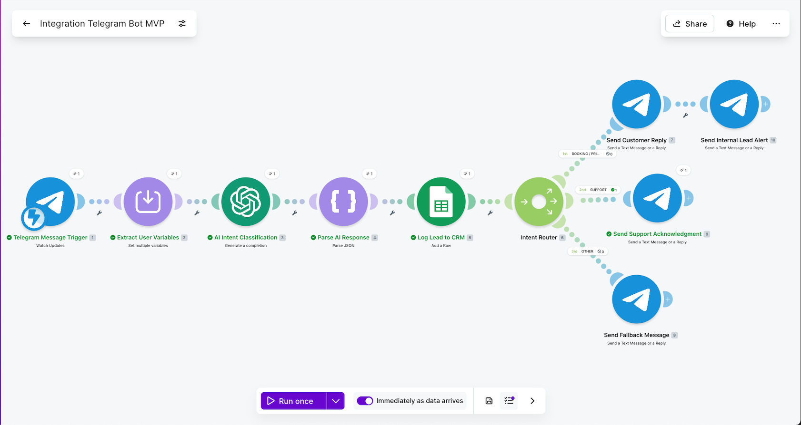
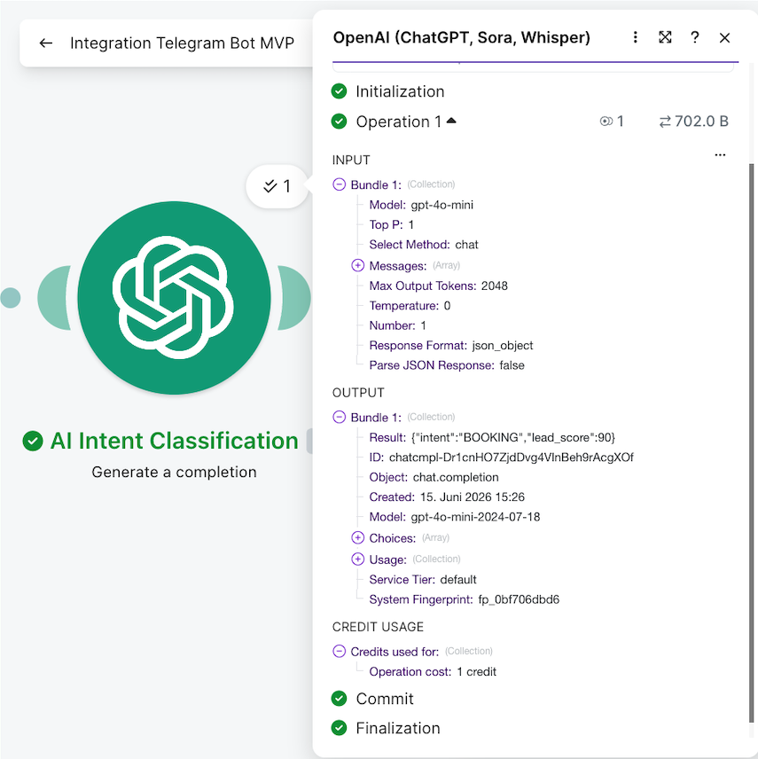
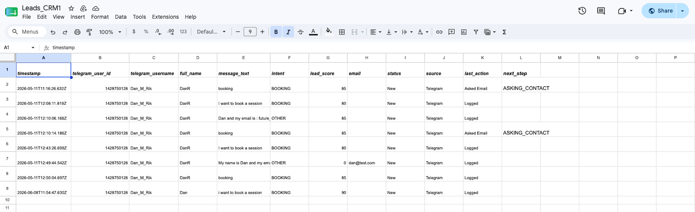
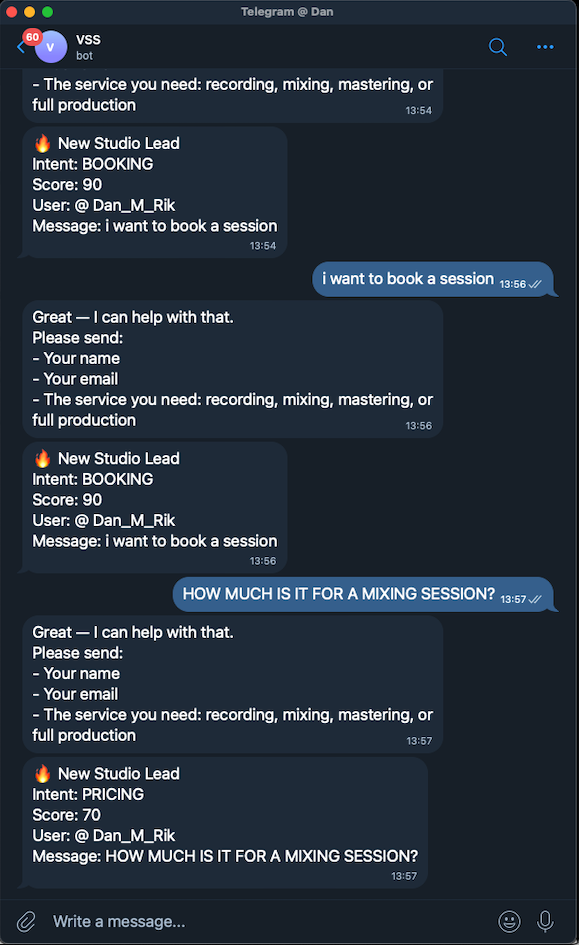
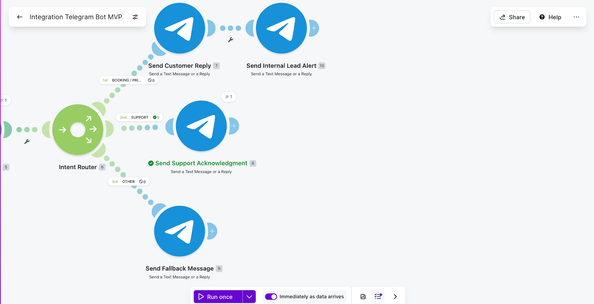

# Telegram Lead Qualification Bot

AI-powered Telegram workflow that classifies incoming messages, identifies lead intent, logs data into Google Sheets, and sends automated replies through Make.

## Demo Video

Short walkthrough of the workflow and how it operates.

👉 [Watch Demo Video](https://www.loom.com/share/482df53075464475a711ecded108170a)

---

## Problem

Small businesses often receive inbound messages through Telegram from potential customers asking about bookings, pricing, or support.

Manually checking every message, identifying the customer intent, replying, and keeping track of the lead can be slow and inconsistent.

This workflow automates the first response process and keeps lead information organized for follow-up.

---

## Workflow Overview

When a user sends a message to the Telegram bot:

1. Telegram triggers the Make workflow.
2. OpenAI analyzes the incoming message.
3. The message is classified by intent.
4. The AI output is converted into structured JSON.
5. The interaction is logged in Google Sheets.
6. A router sends the user through the correct response path.
7. Telegram sends an automated reply or fallback response.

---

## Architecture

Telegram Bot → OpenAI → JSON Parse → Google Sheets → Router → Telegram Reply

---

## Intent Classification

The workflow classifies incoming messages into:

- BOOKING
- PRICING
- SUPPORT
- OTHER

### Example Inputs

| User Message | Intent |
|---|---|
| I want to book a session | BOOKING |
| How much does mixing cost? | PRICING |
| I need help with my order | SUPPORT |
| Hello | OTHER |

---

## Features

- Telegram message trigger
- AI intent classification
- Structured JSON output
- Google Sheets lead logging
- Router-based workflow paths
- Automated Telegram replies
- Fallback handling for unclear messages
- Human follow-up support through logged lead data

---

## Tools Used

- Make
- OpenAI
- Telegram Bot API
- Google Sheets
- JSON parsing
- Router logic

---

## Business Value

This workflow helps small businesses:

- respond faster to inbound messages
- identify potential leads automatically
- reduce manual message handling
- keep customer requests organized
- avoid losing booking or pricing inquiries
- create a simple CRM-style lead log

---

## Skills Demonstrated

- Building a Make automation workflow
- Connecting Telegram with external tools
- Using OpenAI for intent classification
- Working with structured JSON outputs
- Creating routing logic
- Logging automation data into Google Sheets
- Designing fallback paths
- Documenting an automation workflow clearly

---

## Status

Completed as part of an entry-level AI workflow automation portfolio.

---

## Screenshots

### Scenario Overview

### OpenAI Intent Classification Output

### Google Sheets Lead Log

### Telegram Conversation Output

### Router Logic

