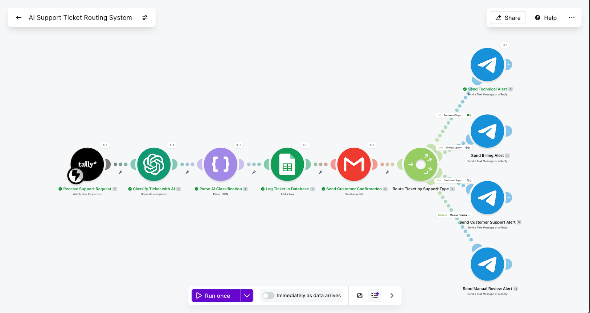
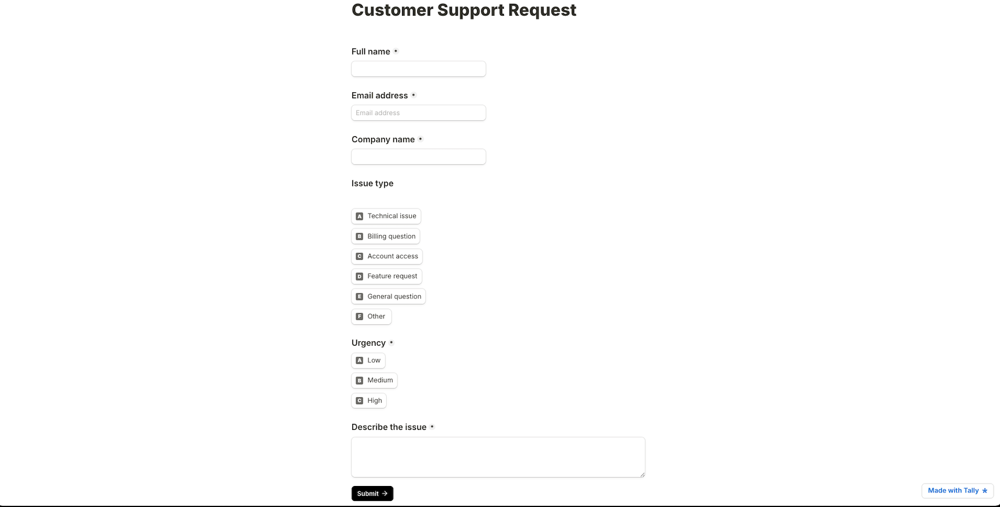
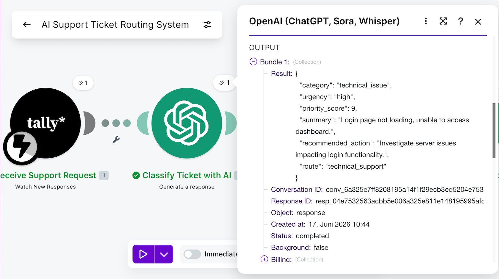
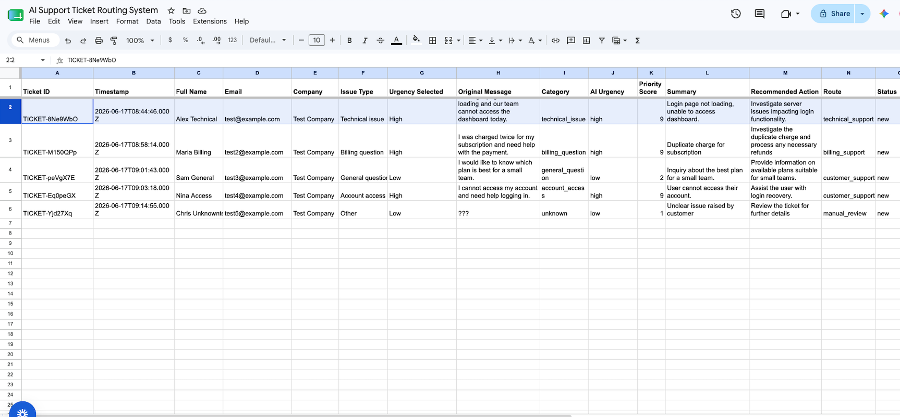
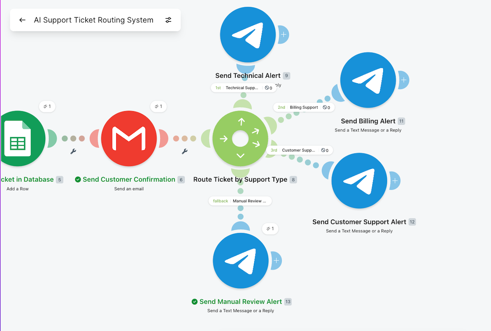
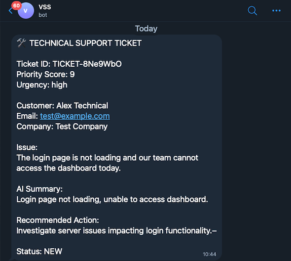
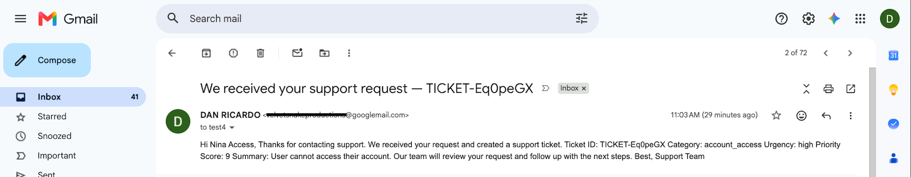

# AI Support Ticket Routing System

AI-powered support workflow that classifies incoming customer support tickets, evaluates urgency, assigns a priority score, logs structured data, and routes each ticket to the correct support path using Make.

## Demo Video

Short walkthrough of the workflow and how it operates.

👉 [Watch Demo Video](#)

---

## Problem

Support teams often receive different types of customer requests through forms or shared inboxes.

Manually reading each message, identifying the issue type, judging urgency, and deciding where to route it can be slow and inconsistent.

This workflow automates the first layer of support triage so urgent and relevant tickets can be handled faster.

---

## Workflow Overview

When a customer submits a support request:

1. Tally captures the support ticket form response.
2. Make triggers the automation.
3. OpenAI analyzes the submitted issue.
4. The ticket is classified by category and urgency.
5. The AI returns structured JSON data.
6. The ticket is logged in Google Sheets.
7. A router sends the ticket to the correct support path.
8. Telegram notifications can alert the correct team or owner.
9. Gmail can send an optional confirmation email to the customer.

---

## Architecture

Tally Form → Make → OpenAI → JSON Parse → Google Sheets → Router → Telegram Notification / Gmail Confirmation

---

## Ticket Classification

The workflow classifies tickets into categories such as:

- technical issue
- billing question
- account access
- feature request
- general question

It also evaluates:

- urgency level
- priority score from 1–100
- short issue summary
- recommended action
- routing path

### Example Inputs

| Customer Issue | Category | Route |
|---|---|---|
| I cannot log into my account | account_access | account |
| My invoice is incorrect | billing_question | billing |
| The app keeps crashing | technical_issue | tech |
| I want to request a new feature | feature_request | product |
| I am not sure who to contact | general_question | fallback |

---

## Features

- Tally support form trigger
- AI ticket classification
- Urgency detection
- Priority scoring from 1–100
- Structured JSON output
- Google Sheets ticket database
- Router-based support paths
- Telegram notifications
- Optional customer confirmation email through Gmail
- Fallback routing for unclear tickets

---

## Tools Used

- Make
- OpenAI
- Tally
- Google Sheets
- Gmail
- Telegram
- JSON parsing
- Router logic

---

## Business Value

This workflow helps support teams:

- reduce manual ticket review
- identify urgent issues faster
- route tickets to the correct team
- keep support data structured
- improve response consistency
- maintain traceability through Google Sheets
- avoid missing unclear or high-priority requests

---

## Skills Demonstrated

- Building a multi-step Make automation
- Connecting Tally form submissions to workflows
- Using OpenAI for ticket classification
- Designing structured JSON outputs
- Creating router-based decision logic
- Logging support tickets into Google Sheets
- Building notification workflows
- Designing fallback paths for unclear cases
- Documenting an operational automation system

---

## Status

Completed as part of an entry-level AI workflow automation portfolio.

## Screenshots

### Scenario Overview

### Tally Form Submission

### OpenAI Ticket Classification Output

### Google Sheets Ticket Database

### Router Routing Logic

### Telegram Alert Output

### Email Confirmation Output

