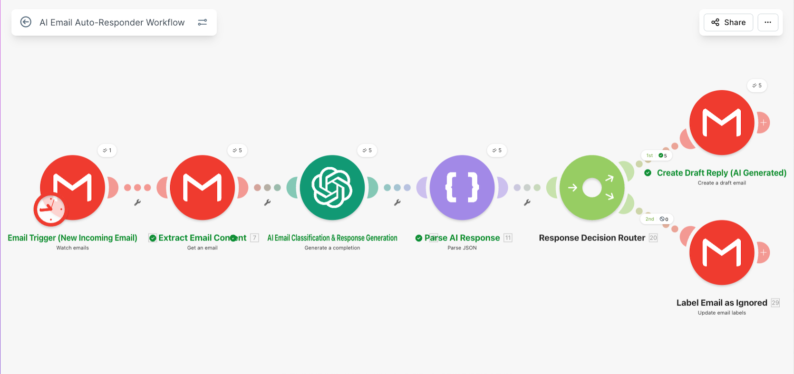
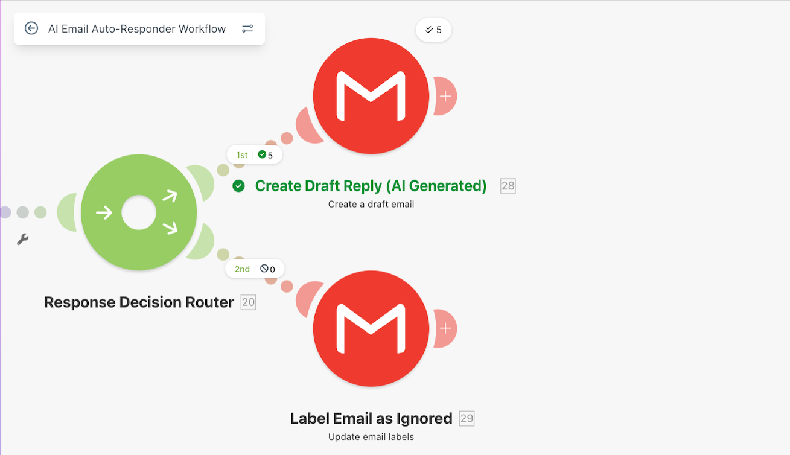
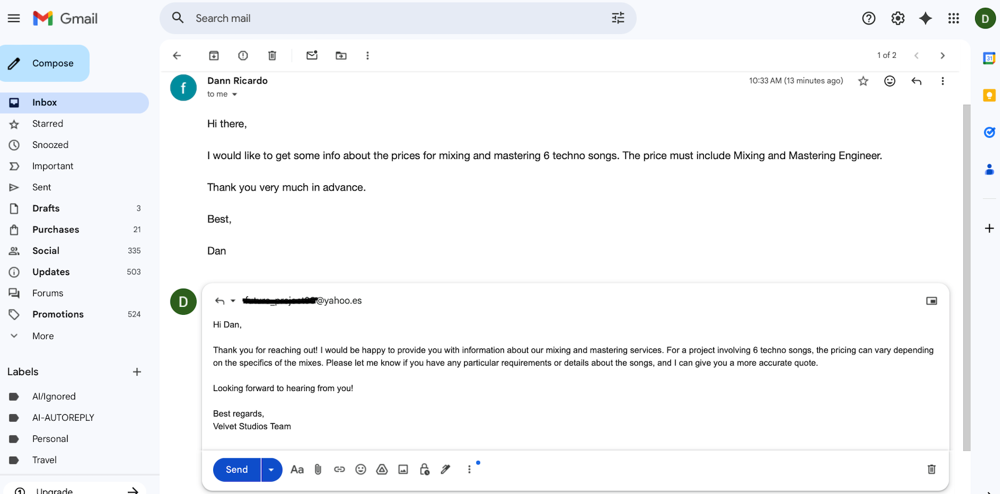

# email-support-auto-responder

## 🎥 Demo Video

Short walkthrough of the workflow and how it operates.

👉 [▶️ Watch Demo Video](https://www.loom.com/share/8ac0332bd36f4fc99840d3a1fa38a016)

## Problem

Handling repetitive emails manually can slow down communication and increase response time, especially when many messages require similar replies.

This workflow was built to reduce repetitive email handling while still keeping human review before responses are sent.

## Workflow Overview

When a new email is received, the workflow sends the message content to OpenAI to classify the request type and generate a draft response.

The generated response is then routed through the workflow and prepared for human review before sending.

## 🏗️ Architecture

Gmail → OpenAI → Data Processing → Router → Draft Response Generation

This workflow uses routing logic to organize incoming emails and automate draft creation for repetitive communication tasks.

Human review remains part of the workflow before responses are finalized.

## 🛠️ Tech Stack

- Make (Integromat)
- OpenAI API
- Gmail API
- Webhooks

## 🚀 Key Features

- Automated email classification
- AI-generated draft responses
- Routing logic for different email types
- Human-in-the-loop review process
- Structured email processing workflows

## Outcome

This workflow helps reduce repetitive email handling and speeds up response preparation while maintaining human oversight before sending replies.

## Possible Improvements

Future improvements could include:
- improved handling of unclear or incomplete emails
- retry logic for failed API responses
- additional routing conditions
- integration with CRM or ticketing systems
- stronger filtering for sensitive or ambiguous email requests

## What I Learned

- Building automated email handling workflows
- Structuring AI-generated responses into usable outputs
- Using routing logic to organize workflow behavior
- Combining automation with human review processes

## 📸 Screenshots

### Automation Architecture

### Router Logic

### Example Output (Gmail Draft)

