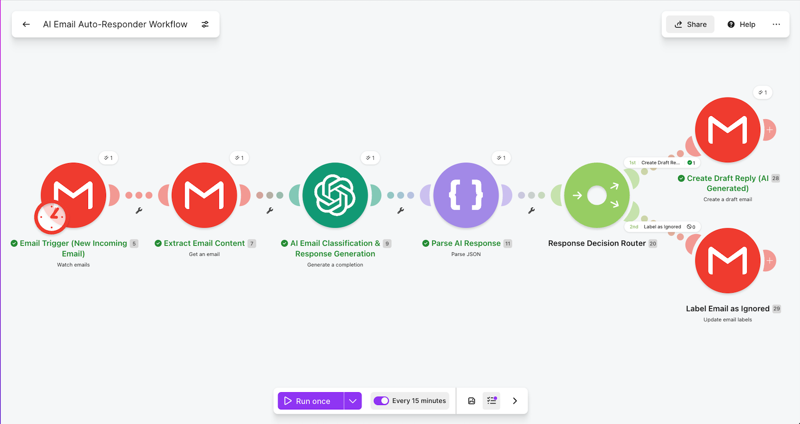
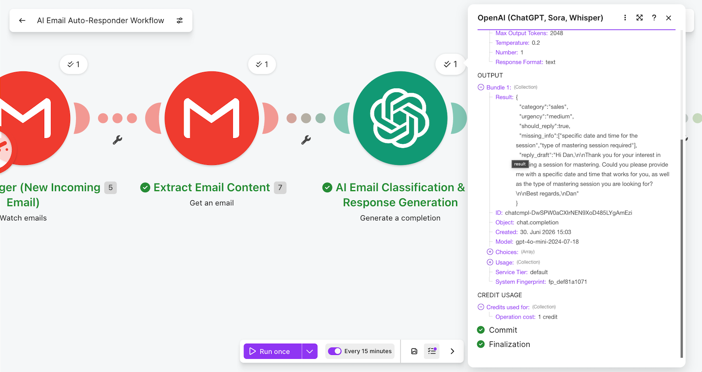
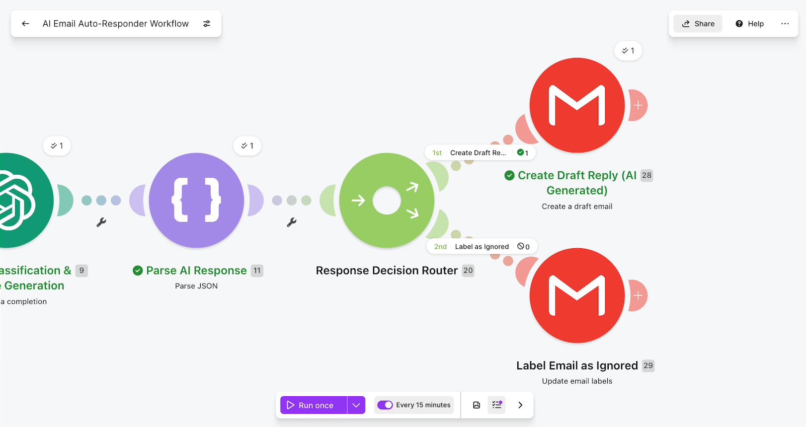
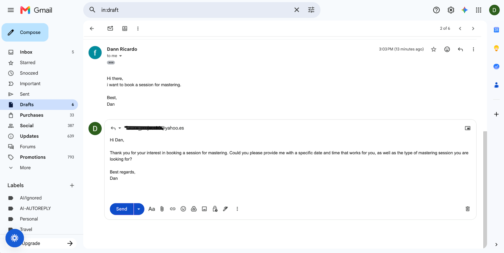
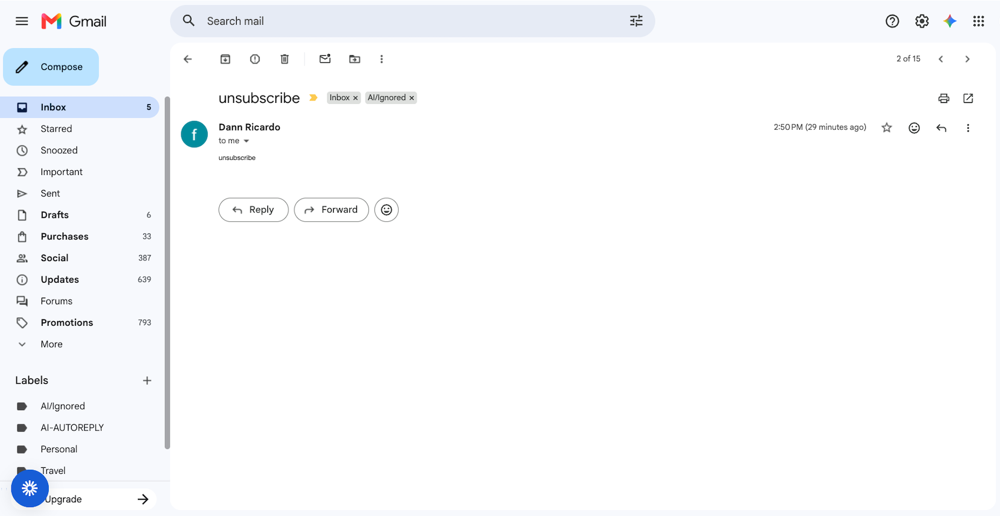

# AI Email Auto-Responder Workflow

AI-assisted email workflow that analyzes incoming emails, classifies the message type, generates a draft response, and keeps a human review step before sending.

## Demo Video

Short walkthrough of the workflow and how it operates.

👉 [Watch Demo Video](#)

---

## Problem

Many businesses receive repetitive emails about support, meetings, questions, or general requests.

Manually reading each email, deciding what type of message it is, and writing a first response can take time and create delays.

This workflow automates the first layer of email handling while keeping human control over the final response.

---

## Workflow Overview

When an email is received:

1. Gmail triggers the Make workflow.
2. OpenAI analyzes the email content.
3. The email is classified by message type.
4. The AI returns structured JSON data.
5. A router sends the email through the correct workflow path.
6. For relevant emails, OpenAI generates a draft response.
7. Gmail creates a draft reply for human review.
8. The email interaction can be logged for tracking.

---

## Architecture

Gmail Trigger → Make → OpenAI → JSON Parse → Router → Gmail Draft / Label / Log

---

## Email Classification

The workflow classifies incoming emails into categories such as:

- support
- meeting
- FAQ
- other

It also evaluates:

- confidence level
- short email summary
- whether an auto-draft should be created
- recommended next action

### Example Inputs

| Email Type | Category | Action |
|---|---|---|
| I need help with a technical issue | support | create draft reply |
| Can we schedule a call next week? | meeting | create draft reply |
| What services do you offer? | FAQ | create draft reply |
| Newsletter or irrelevant message | other | label or ignore |

---

## Features

- Gmail email trigger
- AI email classification
- Structured JSON output
- Router-based workflow paths
- AI-generated draft replies
- Human review before sending
- Gmail draft creation
- Optional email logging
- Fallback handling for unclear emails

---

## Tools Used

- Make
- OpenAI
- Gmail
- JSON parsing
- Router logic
- Google Sheets

---

## Business Value

This workflow helps businesses:

- reduce repetitive email handling
- classify incoming messages faster
- create first-draft responses automatically
- keep humans in control before sending
- improve response speed
- reduce missed or delayed replies
- organize email workflows by message type

---

## Skills Demonstrated

- Building a Gmail-based automation workflow
- Using OpenAI for email classification
- Designing structured JSON outputs
- Creating router-based decision paths
- Generating AI-assisted draft replies
- Keeping human review in the workflow
- Using Gmail automation safely
- Designing fallback paths
- Documenting an AI-assisted communication workflow

---

## Status

Completed as part of an entry-level AI workflow automation portfolio.

---

## Screenshots

### Scenario Overview

### OpenAI Email Classification and Draft Output

### Router Decision Logic

### Gmail Draft Created

### Email Labeled as Ignored

